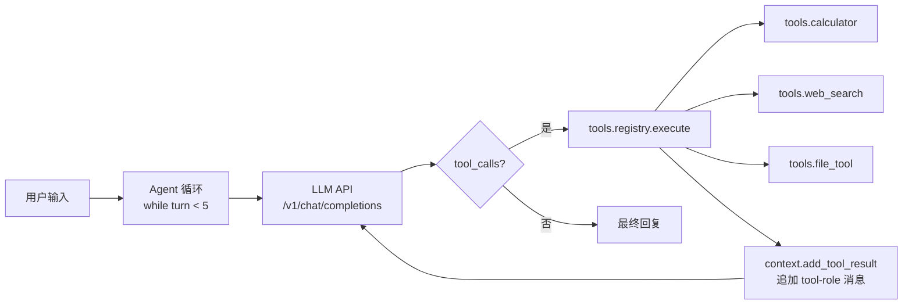
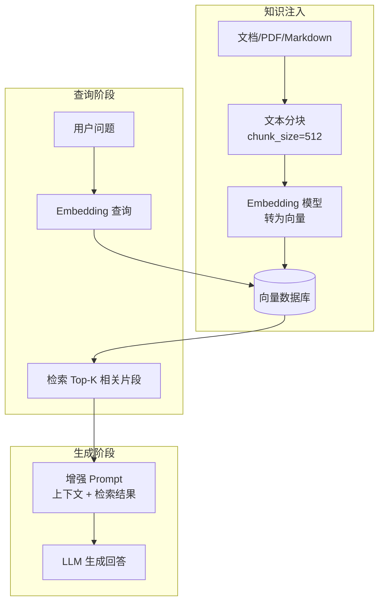
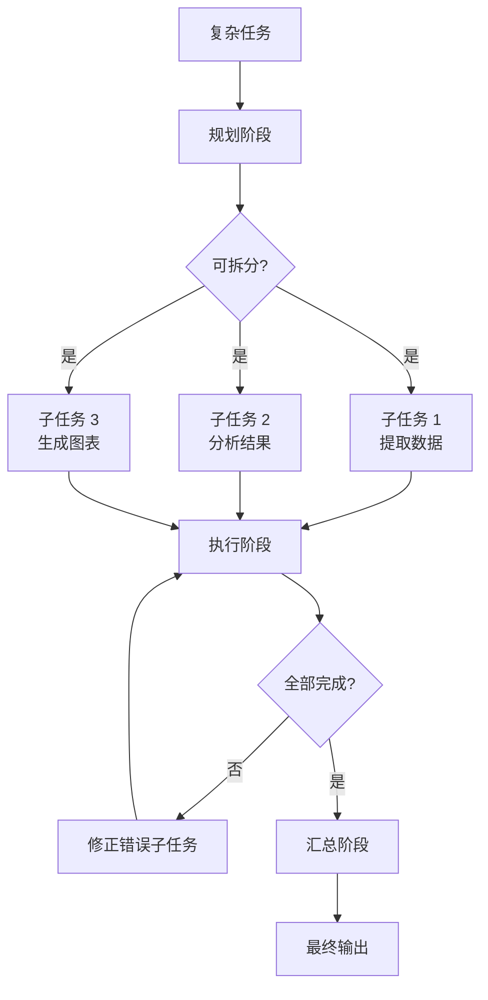
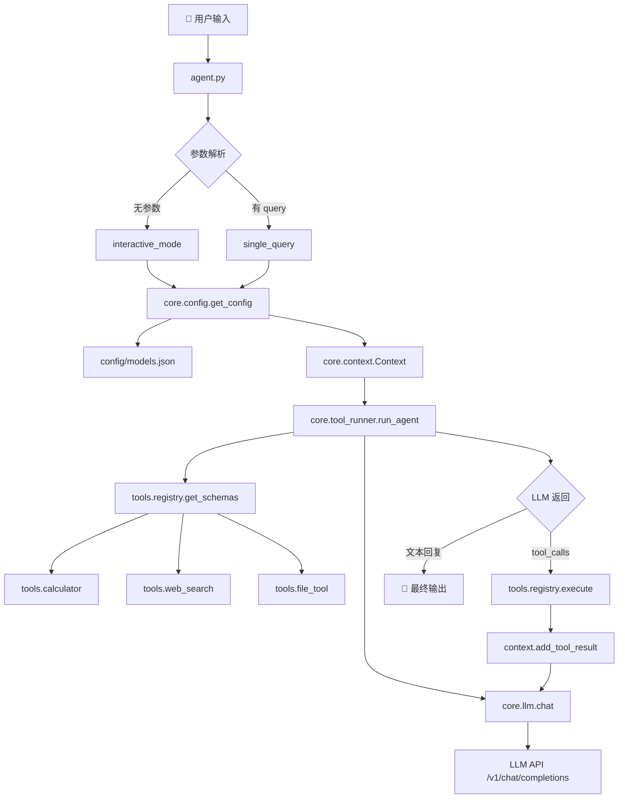
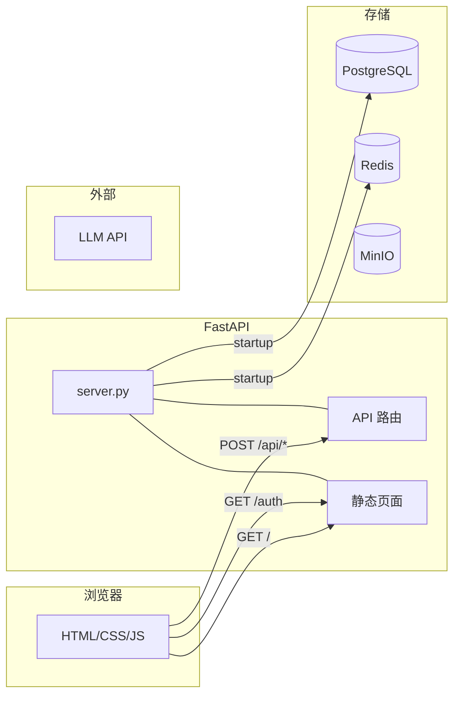
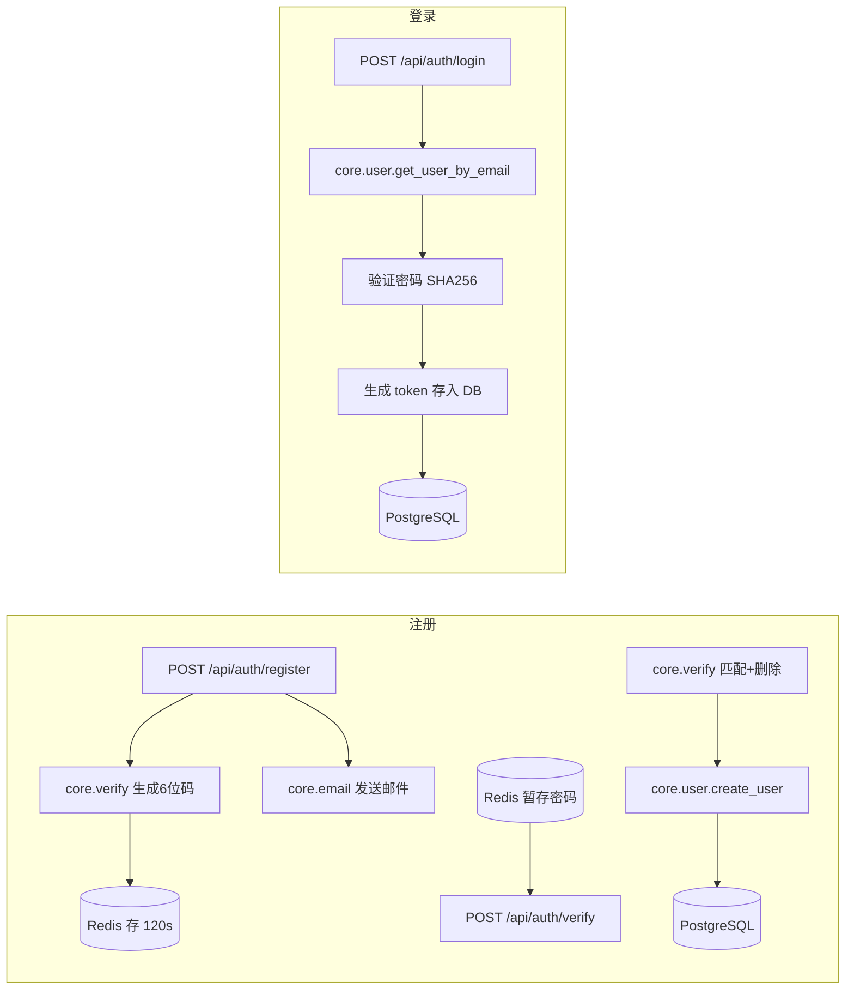
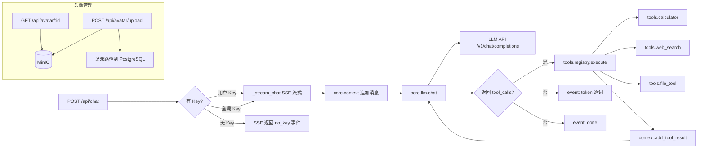
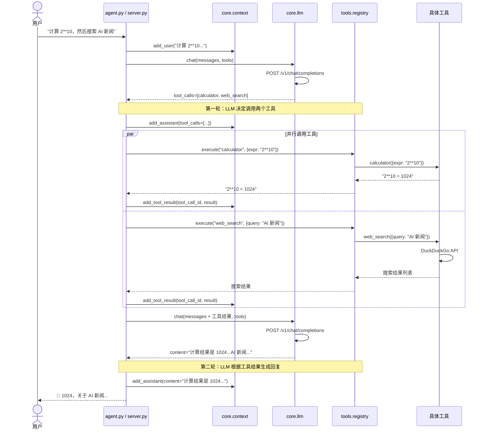
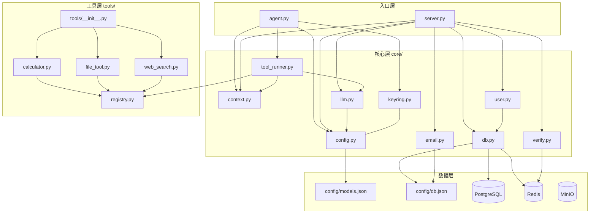

# 🤖 Mini Agent — 从零搭建的 AI Agent

[](https://github.com/theking0912/mini-agent/stargazers)
[](https://github.com/theking0912/mini-agent/blob/main/LICENSE)

一个最小化的 AI Agent 框架 + Web UI，展示 Tool Calling 核心执行原理。

**核心**: ~700 行纯 Python，零 AI 框架依赖，只用 httpx 裸调 HTTP API。
**Web UI**: FastAPI + PostgreSQL + MinIO，支持多用户、多模型、流式对话。

---

## 特性

- **多模型支持** — DeepSeek、OpenAI 等任意 OpenAI 兼容 API，运行时热切换
- **多用户系统** — 邮箱注册/登录，每人独立管理 API Key（加密存储）
- **流式对话** — SSE 实时流式输出，打字机效果
- **工具调用** — 计算器、文件读取、Web 搜索，LLM 自主决策调用
- **用户头像** — MinIO 存储，上传/裁剪/实时刷新
- **Docker 部署** — 一键启动，PostgreSQL + Redis + MinIO 三件套
- **CLI + Web 双模式** — 终端老兵和 Web 新手都能用

---

## 快速开始

### CLI 模式（纯 Python）

```bash
# 安装依赖
pip install -r requirements.txt

# 设置 API Key
export DEEPSEEK_API_KEY='sk-xxx'
export OPENAI_API_KEY='sk-xxx'

# 交互式 REPL
python agent.py

# 单次查询
python agent.py "计算 2 的 10 次方"

# 指定模型
python agent.py --model gpt4o-mini "搜索 AI 新闻"
```

### Web UI（Docker 部署）

```bash
# 需要 PostgreSQL + Redis + MinIO，见下方依赖说明
docker build -t mini-agent:latest .
docker run -d \
  --name mini-agent \
  --restart unless-stopped \
  -p 8080:8080 \
  -v mini-agent-data:/data \
  mini-agent:latest
```

访问 `http://localhost:8080` → 注册账号 → 在设置中添加 API Key → 开始聊天。

---

## 依赖服务

### PostgreSQL（用户数据 + 配置）

```bash
docker run -d \
  --name mini-agent-pg \
  --restart unless-stopped \
  -e POSTGRES_PASSWORD=LeroyLee \
  -e POSTGRES_DB=mini_agent \
  -p 5433:5432 \
  postgres:16
```

### Redis（验证码缓存）

```bash
docker run -d \
  --name mini-agent-redis \
  --restart unless-stopped \
  -p 6379:6379 \
  redis:7
```

### MinIO（头像存储）

```bash
docker run -d \
  --name mini-agent-minio \
  --restart unless-stopped \
  -e MINIO_ROOT_USER=leroy \
  -e MINIO_ROOT_PASSWORD=<your-password> \
  -p 9000:9000 -p 9001:9001 \
  minio/minio server /data --console-address ":9001"
```

---

## 配置

### 数据库 & 服务连接

`config/db.json`:

```json
{
  "pg_host": "172.18.0.1",
  "pg_port": 5433,
  "pg_db": "mini_agent",
  "pg_user": "postgres",
  "pg_password": "LeroyLee",
  "redis_host": "172.18.0.1",
  "redis_port": 6379
}
```

### 多模型配置

`config/models.json` — 支持任意 OpenAI 兼容 API：

```json
{
  "default": "deepseek",
  "models": {
    "deepseek": {
      "api_key": "${DEEPSEEK_API_KEY}",
      "base_url": "https://api.deepseek.com/v1",
      "model": "deepseek-chat",
      "description": "DeepSeek V3"
    },
    "gpt4o": {
      "api_key": "${OPENAI_API_KEY}",
      "base_url": "https://api.openai.com/v1",
      "model": "gpt-4o",
      "description": "OpenAI GPT-4o"
    }
  }
}
```

Key 管理原则：
- **API Key 不进配置文件** — `${ENV_VAR_NAME}` 语法引用环境变量
- **Web UI 中每个用户独立管理 Key** — 加密存入 PostgreSQL JSONB 字段
- **运行时热切换** — 聊天时随时切换模型，无需重启

---

## 项目结构

```
mini-agent/
├── agent.py                  ← CLI 入口（交互式 REPL + 命令行）
├── server.py                 ← Web UI 服务端（FastAPI）
├── requirements.txt          ← Python 依赖
├── Dockerfile                ← Docker 镜像构建
├── config/
│   ├── models.json           ← 多模型配置文件
│   └── db.json               ← 数据库连接配置
├── core/
│   ├── llm.py                ← LLM API 通信层
│   ├── config.py             ← 模型配置加载器
│   ├── context.py            ← 对话上下文管理
│   ├── db.py                 ← PostgreSQL + Redis 连接池
│   ├── user.py               ← 用户注册/登录/API Key 管理
│   ├── email.py              ← 邮件发送（邮箱验证码）
│   └── verify.py             ← 验证码生成/校验
├── tools/
│   ├── registry.py           ← 工具注册中心
│   ├── calculator.py         ← 计算器工具
│   ├── file_tool.py          ← 文件读取工具
│   └── web_search.py         ← 网络搜索工具
└── web/
    ├── index.html            ← Web UI 主界面（聊天 + 设置）
    └── auth.html             ← 注册/登录页
```

---

## 架构

### 执行流程

```plaintext
用户输入 ─→ LLM(理解意图) ─→ 调用工具 ─→ LLM(组织回复) ─→ 输出
                  ↑                              │
                  └────── 工具结果回流 ────────────┘
```

### Web UI 架构

```plaintext
浏览器 ←SSE→ FastAPI Server ←HTTP→ LLM API
                │
          ┌─────┼─────┐
          │     │     │
      PostgreSQL Redis MinIO
      (用户/Key)  (验证码) (头像)
```

---

## API 概览

| 路径 | 方法 | 说明 |
|------|------|------|
| `/` | GET | Web UI 主页面 |
| `/auth` | GET | 注册/登录页 |
| `/api/auth/register` | POST | 注册（发送验证码） |
| `/api/auth/verify` | POST | 验证邮箱 |
| `/api/auth/login` | POST | 登录 |
| `/api/auth/me` | GET | 当前用户信息 |
| `/api/auth/logout` | POST | 退出登录 |
| `/api/models` | GET | 可用模型列表 |
| `/api/switch` | POST | 切换模型 |
| `/api/chat` | POST | 发送消息（SSE 流式响应） |
| `/api/reset` | POST | 重置对话上下文 |
| `/api/key/set` | POST | 保存 API Key |
| `/api/key/remove` | POST | 删除 API Key |
| `/api/key/list` | GET | 已保存的 Key 列表 |
| `/api/avatar/upload` | POST | 上传头像 |
| `/api/avatar/{id}` | GET | 获取头像 |

---

## 架构模式与演进

Mini Agent 展示了从最简单的"调 API"到完整的多用户 Web 系统的演进过程。以下三个核心模式是理解 AI Agent 的关键。

---

### Tool Calling — 工具调用环

这是 Agent 最基础的执行模式，也是当前 mini-agent 的核心。

**执行原理：**



**关键代码链路：**

```
tool_runner.py (CLI) / server.py (Web)
  └─ registry.get_schemas()      # 生成 JSON Schema 给 LLM 看
  └─ llm.chat(messages, tools)   # LLM 自主决定是否调工具
  └─ registry.execute(name, args) # 执行找到的函数
  └─ context.add_tool_result()   # 结果回注上下文
```

**核心原则：**

| 原则 | 说明 |
|------|------|
| **让 LLM 决定** | `tool_choice: "auto"` — 不强制调工具 |
| **工具是纯函数** | 每个工具接收 `dict` 参数，返回 `str` 结果 |
| **结果环回** | 工具结果以 `tool-role` 消息追加到上下文，LLM 再据此组织回复 |
| **安全边界** | calculator 用 AST 白名单（非 eval），file_tool 用路径黑名单 |

**当前实现 (v6)：** `tools/registry.py` + `core/tool_runner.py`，支持 3 个工具，最大 5 轮循环。

---

### RAG — 检索增强生成

RAG 让 Agent 能访问私有知识库，而不需要重新训练模型。

**架构设计：**



**在 mini-agent 中集成 RAG 的方式：**

```
core/rag.py (新增模块)
  ├── DocumentChunker    — 文本分块器
  ├── VectorStore        — 向量存储抽象（支持 Chroma / FAISS / PGVector）
  └── Retriever          — 检索器（embedding + 相似度搜索）

tools/retrieval.py (新增工具)
  └── @register("retrieve_knowledge", ...)
      └── 调用 rag.Retriever.search(query) → 返回相关片段
```

**关键决策点：**

| 决策 | 选项 | 推荐（轻量级） |
|------|------|----------------|
| Embedding 模型 | OpenAI / local / 本地 API | 用 LLM 同厂的 embedding API |
| 向量数据库 | Chroma / FAISS / PGVector / Milvus | Chroma（零依赖，文件存储） |
| 分块策略 | 固定大小 / 语义分块 | 512 tokens, 128 overlap |
| 注入方式 | Tool / Pre-prompt / 路由 | Tool 方式最灵活 |

**数据流：**

```
用户提问 "什么是 RAG？"
  → LLM 决定调用 retrieve_knowledge(query="RAG 定义")
  → 工具内部：query → embedding → 向量检索 → 返回 Top-3 片段
  → 工具结果注入上下文
  → LLM 根据检索结果 + 自身知识生成回答
```

**TODO 实现指引：**

```
# 1. 安装依赖
pip install chromadb sentence-transformers

# 2. 新建 core/rag.py — 分块 + 检索逻辑
# 3. 新建 tools/retrieval.py — @register 工具
# 4. 启动时加载知识库到向量库
# 5. 用户可选在哪类对话中启用 RAG
```

---

### Task Planning — 任务规划

当用户提出复杂请求（如"分析这份报告并生成图表"），需要 Agent 将其分解为多个子任务，有序执行。

**架构设计：**



**三种规划模式对比：**

| 模式 | 说明 | 适用场景 | 复杂度 |
|------|------|---------|--------|
| **ReAct** | 边想边做：Thought → Action → Observation → Thought | 简单任务链 | 低 |
| **Plan & Execute** | 先规划再执行：一次规划，顺序执行 | 确定性多步骤任务 | 中 |
| **Tree of Thought** | 多路径探索：同时探索多个方案，择优 | 创意/推理密集型 | 高 |

**在 mini-agent 中的实现方案：**

```python
# 方案一：Prompt 驱动（无需改代码）
# 在 system prompt 中加入规划指令
SYSTEM_PROMPT = """你是一个智能助手。
对于复杂任务，请按以下步骤：
1. 分解任务为子步骤
2. 逐一执行每个子步骤
3. 汇总结果

例如：请先调用 plan 工具列出子任务，再逐一执行。"""

# 方案二：新增 Plan & Execute 模块
core/planner.py
  └── plan(task) → list[subtask]     # LLM 生成子任务列表
  └── execute_plan(subtasks) → str   # 顺序执行每个子任务
  └── report(results) → str          # 汇总输出
```

**ReAct 模式的上下文结构：**

```
messages = [
  {"role": "system", "content": "..."},
  {"role": "user",   "content": "分析上月销售数据"},
  {"role": "assistant", "content": "让我先读取数据文件"},
  {"role": "assistant", "tool_calls": [read_file(...)]},
  {"role": "tool",   "content": "文件内容..."},
  {"role": "assistant", "content": "数据已读取，接下来计算增长率"},
  {"role": "assistant", "tool_calls": [calculator(...)]},
  {"role": "tool",   "content": "增长率为 15.3%"},
  {"role": "assistant", "content": "上月销售增长率 15.3%，趋势向好..."},
]
```

**演进路线图：**

| 版本 | 新增能力 | 代码量估 |
|------|---------|---------|
| v1 | 调 API，能调用 2-3 个工具 | ~300 行 |
| v2 | 上下文记忆（SQLite） | +100 行 |
| v3 | 多轮对话 + 工具链编排 | +150 行 |
| v4 | MCP 协议支持（动态注册工具） | +300 行 |
| v5 | **多模型 Key 适配 + 运行时切换** | +200 行 |
| v6 | **Web UI + 多用户 + 头像管理** | +800 行 |
| v7 | **RAG 知识库检索** | +400 行 |
| v8 | **Task Planning 任务规划** | +350 行 |
| v9 | **记忆持久化 + 跨会话上下文** | +250 行 |
| v10 | **多 Agent 协作 + 任务委派** | +500 行 |

---

### 三种模式的对比

| 维度 | Tool Calling | RAG | Task Planning |
|------|-------------|-----|---------------|
| **核心问题** | 如何执行动作 | 如何获取知识 | 如何分解任务 |
| **关键组件** | Registry + Executor | Embedding + Vector DB | Planner + Executor |
| **依赖** | 无 | embedding 模型 + 向量库 | 无（纯 prompt） |
| **当前状态** | ✅ 已实现 | 🔜 计划中 | 🔜 计划中 |
| **实现难度** | ⭐ | ⭐⭐ | ⭐⭐ |
| **收益** | Agent 能操作外部工具 | Agent 能访问私域知识 | Agent 能处理复杂任务 |

---

---

# 二、代码架构分析

## 调用流程图

### CLI 模式（`agent.py`）



### Web UI 模式（`server.py`）

**① 整体架构 — 服务拓扑**



**② 注册登录流程**



**③ 聊天 + 工具体系**



### Agent 核心循环（Tool Calling Loop）



### 多模型 Key 适配体系

```mermaid
flowchart LR
    subgraph 配置层
        MJ[config/models.json]
        DJ[config/db.json]
    end
    
    subgraph Key 来源
        EV[环境变量: DEEPSEEK_API_KEY]
        KR[core.keyring · 加密文件 keys.enc]
        UK[core.user · 用户独立 Key · PostgreSQL JSONB]
    end
    
    subgraph 解析层
        CP[core.config\n_resolve_api_key]
    end
    
    subgraph 最终用户
        CLI[agent.py CLI]
        WEB[server.py Web]
    end
    
    MJ --> CP
    EV --> CP
    KR --> CP
    DJ --> DB[core.db]
    DB --> UK
    
    CP --> CLI
    UK --> WEB
    
    style EV fill:#2d5a27
    style KR fill:#5a3d2d
    style UK fill:#2d3d5a
```



---

## 文件依赖关系



---

## 各文件关键数据

| 文件 | 行数 | 关键数据结构 | 核心函数 |
|------|------|-------------|---------|
| `agent.py` | 302 | `Context`, `AppConfig` | `interactive_mode()`, `single_query()` |
| `server.py` | 563 | `_context`(全局), FastAPI routes | `_stream_chat()`, `_minio_put()` |
| `core/config.py` | 234 | `AppConfig`, `ModelConfig` | `load_config()`, `_resolve_api_key()` |
| `core/context.py` | 101 | `Context.messages: list[dict]` | `add_user()`, `add_tool_result()` |
| `core/llm.py` | 148 | `LLMResponse` | `chat()` |
| `core/tool_runner.py` | 83 | (无，纯函数) | `run_agent()` |
| `core/keyring.py` | 190 | `keys.enc` (Fernet 加密 JSON) | `save_key()`, `load_key()` |
| `core/db.py` | 131 | 连接池 + Redis 客户端 | `get_conn()`, `init_db()` |
| `core/user.py` | 239 | PostgreSQL `users` 表 | `create_user()`, `login_user()`, `set_user_key()` |
| `core/verify.py` | 47 | Redis `verify:register:email` | `generate_code()`, `verify_code()` |
| `core/email.py` | 149 | SMTP 连接 | `send_verification_code()` |
| `tools/registry.py` | 74 | `_registry: dict[str, dict]` | `register()`, `execute()` |
| `tools/calculator.py` | 76 | AST 白名单 | `_safe_eval()` |
| `tools/web_search.py` | 54 | DuckDuckGo 搜索 | `_search_ddg()` |
| `tools/file_tool.py` | 50 | 路径黑名单 | `read_file()` |
| `web/index.html` | 1041 | CSS + JS 内联单页 | SSE 客户端, 模型状态管理 |
| `web/auth.html` | 398 | 登录/注册切换 | 验证码倒计时, 表单验证 |

---

## 代码 Review 总结

| 等级 | 问题 | 文件 | 影响 |
|------|------|------|------|
| 🔴 严重 | 全局 `_context` 所有用户共享 | `server.py:32` | 多用户串对话 |
| 🔴 严重 | `user.py` 每次新建 DB 连接（未用池子） | `core/user.py` | 高并发连接耗尽 |
| 🔴 严重 | `llm.py` 用同步 `httpx.Client` | `core/llm.py:99` | 阻塞 FastAPI 事件循环 |
| 🔴 严重 | 文件读取黑名单太弱（白名单更好） | `tools/file_tool.py:34` | 敏感文件泄露风险 |
| 🟠 架构 | 双份 Agent 循环代码（CLI + Web 各一套） | `tool_runner.py` + `server.py` | 维护成本翻倍 |
| 🟠 架构 | SSE "打字效果"是虚假流式（先等全响应再逐词吐出） | `server.py:521` | 用户体验差 |
| 🟠 架构 | `email.py` 自己读 `db.json`，不与 `db.py` 复用 | `core/email.py:16` | 配置加载不统一 |
| 🟡 整洁 | 100 行 AWS Signature V4 实现在 `server.py` 内联 | `server.py:50-172` | 应提到 `core/storage.py` |
| 🟡 整洁 | import 散落在函数内部（`from core import llm`） | `server.py:498` | 风格不一致 |
| 🟡 整洁 | `calculator.py` docstring 残缺 "计...器" | `tools/calculator.py:3` | 排版瑕疵 |
| 🟢 细节 | 上下文 token 估算不准（中文偏差大） | `core/context.py:82` | 中文用户可能过早裁剪 |

---

## 许可证

MIT
